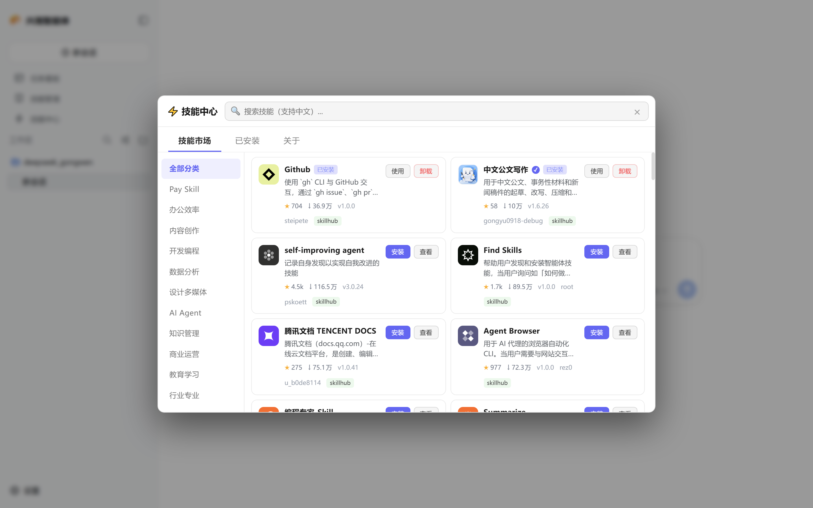
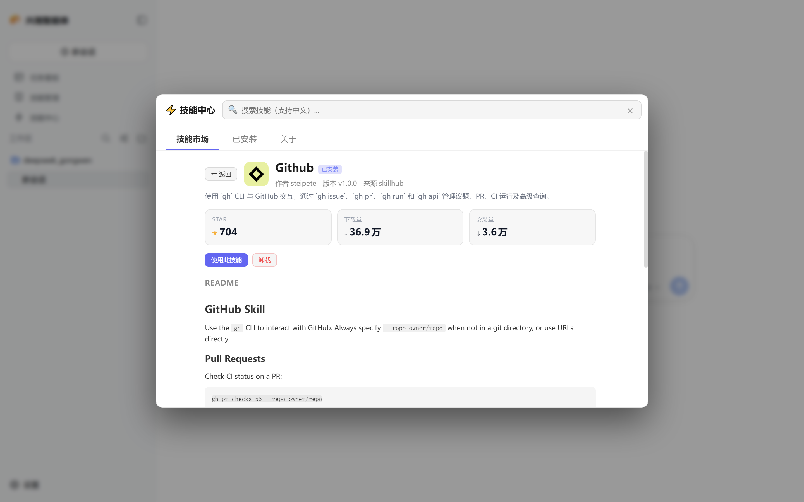
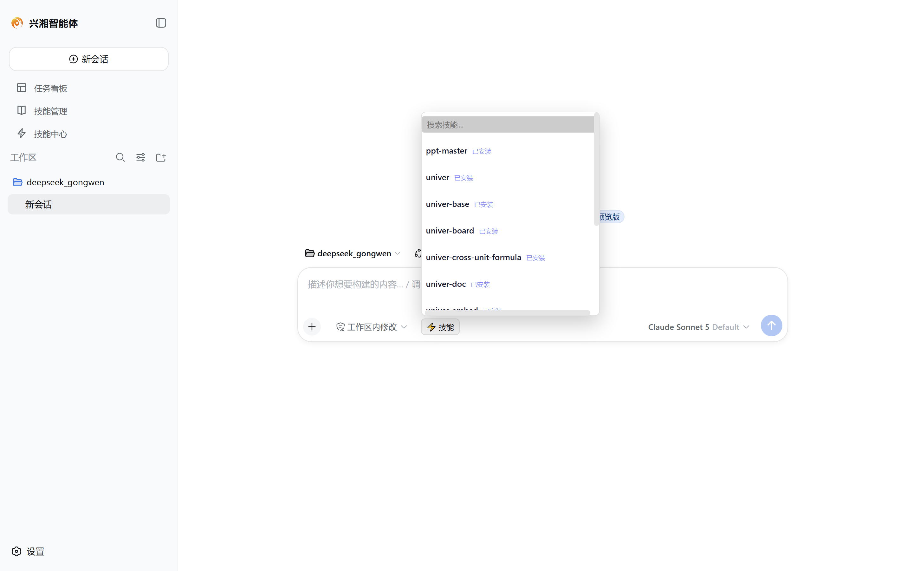

# dsh-skill-hub

[简体中文](./README.md) | **English**

A skill marketplace plugin for DeepSeek Harness — aggregated search across SkillHub + ClawHub, in-app README preview, one-click install/uninstall, a chat-input skill picker, and a sidebar skill hub panel.

<p align="center">
  
</p>

## Features

- **Skill search**: aggregated results from SkillHub (Tencent Cloud China mirror, fast direct connection) and ClawHub (the official OpenClaw source); supports Chinese queries
- **One-click install/uninstall**: installs into `$DSH_HOME/skills/`, auto-discovered by skill-filesystem
- **In-app README preview**: Markdown rendered natively in the detail view, no external redirects
- **Star / download stats**: stars, downloads and installs shown on cards and in the detail view
- **Skill hub panel**: sidebar entry → fullscreen overlay for search, install, browse and inspect
- **Chat-input picker**: a "⚡ Skills" button in the input bar for quick insertion of `/skill-name`
- **Source failover**: falls back to ClawHub when SkillHub fails, and vice versa

## Screenshots

| Marketplace | Skill detail |
|---|---|
|  |  |

Chat-input skill picker:

<p align="center">
  
</p>

## Installation

```bash
dsh plugin --profile web add "github:pn1024/dsh-skill-hub"
```

Or install from a local path:

```bash
dsh plugin --profile web add "/path/to/dsh-skill-hub"
```

## Architecture

```
dsh-skill-hub/
├── package.json           # dsh.bundle.patch + dsh.client declarations
├── cordis.patch.yml       # plugin registration + config
├── src/
│   ├── index.js           # Host side: RPC intercept (skill-hub/*)
│   └── client.js          # Browser side: UI slot registration (sidebar/overlay/input)
├── assets/                # brand assets (logo icons, etc.)
├── docs/screenshots/      # UI screenshots
├── LICENSE
└── README.md
```

### Host-side RPC endpoints

| Endpoint | Description |
|----------|-------------|
| `skill-hub/search` | Search skills (SkillHub + ClawHub aggregated) |
| `skill-hub/detail` | Skill detail (README, version, stats) |
| `skill-hub/installed` | List locally installed skills |
| `skill-hub/install` | Download and install a skill locally |
| `skill-hub/uninstall` | Uninstall a local skill |
| `skill-hub/readme` | Read an installed skill's README/SKILL.md |

### Browser-side UI slots

| Slot | Description |
|------|-------------|
| `sidebar.footer.action` | "Skill Hub" entry button in the sidebar |
| `shell.overlay` | Fullscreen skill hub panel |
| `conversation.input.left` | "⚡ Skills" quick picker in the chat input bar |

## Data sources

| Platform | API base | Notes |
|----------|----------|-------|
| SkillHub | `https://api.skillhub.tencent.com` | Tencent Cloud China mirror, fast direct connection, Chinese search |
| ClawHub | `https://clawhub.com` | Official OpenClaw skill community, globally available |

## Configuration

Configurable in `cordis.patch.yml`:

```yaml
- insert:
    - id: dsh-skill-hub
      name: 'dsh-skill-hub'
      config:
        skillhubApiBase: https://api.skillhub.tencent.com
        clawhubApiBase: https://clawhub.com
        localSkillsDir: ''        # empty = use $DSH_HOME/skills
        preferSkillHub: true       # prefer SkillHub for users in China
```

## License

MIT
